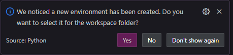
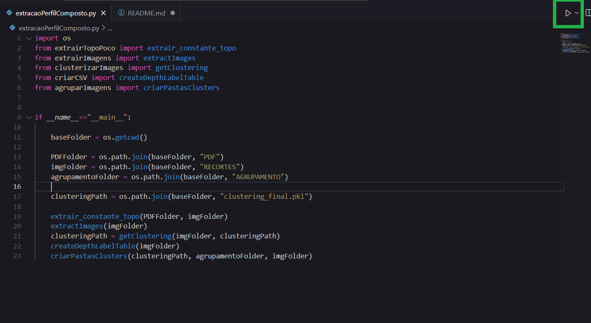

# 1. Como Instalar o Python

## Verificar se o Python já está instalado

Antes de instalar, verifique se o Python já está disponível no seu sistema. Para isso, abra o terminal (Linux/macOS) ou o Prompt de Comando (Windows) e execute:

```sh
python --version
```

Ou, em alguns sistemas, pode ser necessário usar:

```sh
python3 --version
```

Se o Python estiver instalado, a saída mostrará a versão, como:

```
Python 3.x.x
```

Caso receba um erro informando que o comando não foi encontrado, siga os próximos passos para instalá-lo.

---

## Baixar o Python

Acesse o site oficial do Python:

[Site Oficial do Python](https://www.python.org/downloads/)

Baixe a versão mais recente recomendada para seu sistema operacional.

Caso queira baixar a versão 3.10.1, usada no projeto, acesse o link:

[Python 3.10.1](https://www.python.org/downloads/release/python-3101/)

---

## Instalar o Python

### Windows
1. Execute o instalador baixado (`python-3.x.x.exe`).
2. **Marque a opção**: `Add Python to PATH` antes de continuar.
3. Clique em **Install Now** e aguarde a instalação ser concluída.
4. Para confirmar a instalação, abra o Prompt de Comando e digite:

    ```sh
    python --version
    ```

---

# 2. Como Instalar o Visual Studio Code (VS Code)

## Baixar o Instalador

Acesse o site oficial do VS Code:

[Site Oficial do VS Code](https://code.visualstudio.com/)

Clique no botão **Download for Windows** e baixe o instalador `.exe`.

---

## Instalar o VS Code no Windows

1. Execute o arquivo `.exe` baixado.
2. Marque a opção **Add "Open with Code" action to Windows Explorer file context menu** para facilitar o acesso.
3. Clique em **Next** e depois em **Install**.
4. Aguarde a instalação ser concluída e clique em **Finish**.

---

## Verificar a Instalação

Para garantir que o VS Code foi instalado corretamente, abra o Prompt de Comando ou abra o atalho na área de trabalho e execute:

```sh
code --version
```

Se o comando retornar a versão do VS Code, a instalação foi bem-sucedida!

---

# 3. Criando um ambiente virtual no Python

## Abrir uma Pasta e Criar um Ambiente Virtual

### Abrir uma Pasta no VS Code

1. Abra o VS Code.
2. No menu superior, clique em **File** > **Open Folder**.
3. Escolha a pasta desejada e clique em **Select Folder**.

### Criar um Ambiente Virtual em Python

1. No VS Code, abra o terminal pressionando `Ctrl + J` ou acesse **Terminal** > **New Terminal**.
2. Crie um ambiente virtual com o seguinte comando:

   ```sh
   python -m venv venv
   ```

3. Ative o ambiente virtual:
    - O VS Code provavelmente vai perceber que você criou um ambiente virtual. Se um pop-up aparecer, clique em "Yes" para ativá-lo automaticamente.
    - Caso o pop-up não apareça, ative manualmente digitando no **Windows (CMD ou PowerShell)**:
     ```sh
     venv\Scripts\activate.bat
     ```
    
   
5. Agora, para instalar as bibliotecas necessárias para rodar o extrator, execute:
    ```sh
    python -m pip install -r requirements.txt
    ```
    ou
   ```sh
   venv\Scripts\python.exe -m pip install -r requirements.txt
   ```
---

# 5. Rodando o projeto

Uma vez instaladas todas as dependências, para executar o projeto, abra o arquivo `extracaoPerfilComposto.py` no VS Code e clique no botão de execução.



